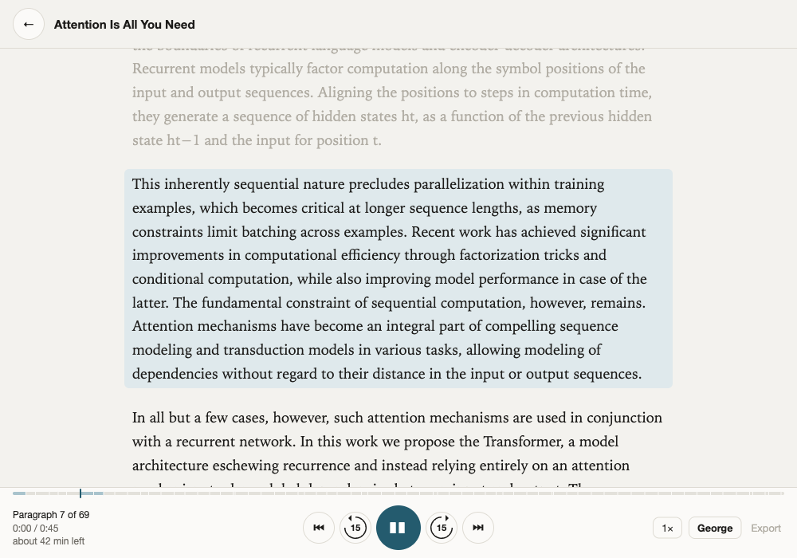
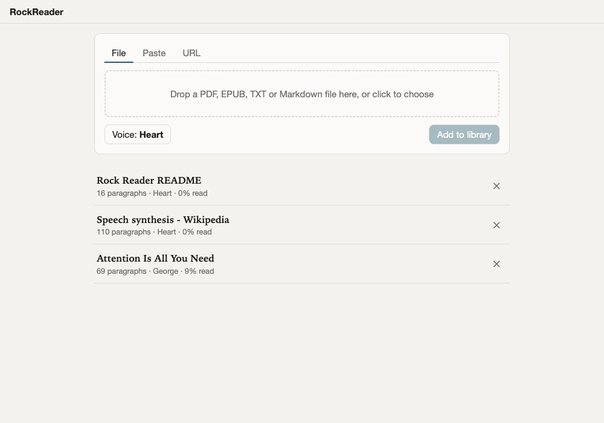
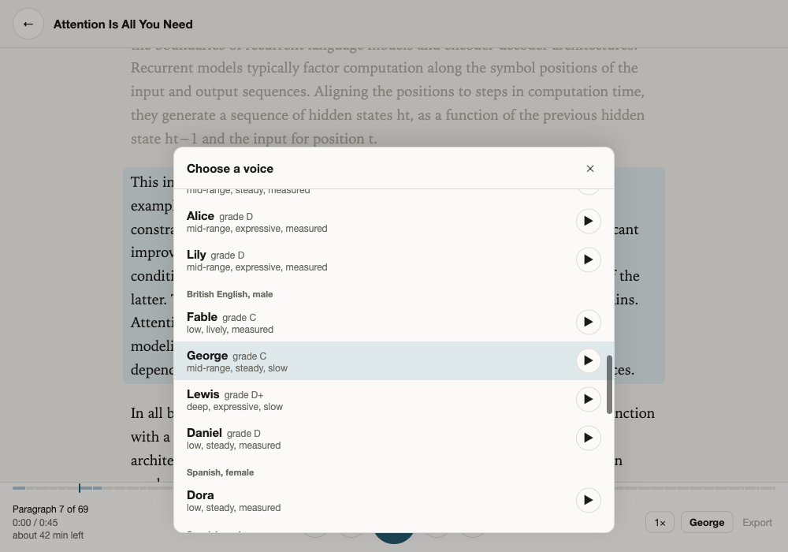
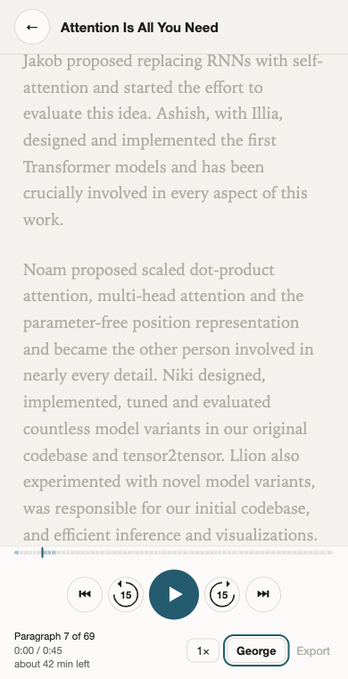

# RockReader

RockReader is a local text-to-speech reader for long documents, built for Apple Silicon. Drop in a PDF or EPUB, it reads it back to you with the Kokoro-82M voice model, and you can jump around by paragraph, skip 15 seconds either way, change speed, and pick up where you left off. Nothing leaves the machine.

It also exposes a plain speech endpoint (`POST /v1/audio/speech`) that streams audio for any text you send it.

**Hear it:** [readme.mp3](docs/readme.mp3) is this README, read by the Heart voice and exported from the app (5 min, 4 MB).

<p align="center"></p>

<p align="center"> </p>

<p align="center"></p>

## Why this setup

- **Kokoro-82M on MLX** (via `mlx-audio`): runs natively on the Apple GPU, about 300 MB of memory, 5-20x faster than realtime depending on the chip. Consistent pronunciation from a dictionary-based phonemizer, which suits academic text. Larger LLM-style voices (Orpheus 3B and friends) need ~8 GB, run near realtime, and can repeat or skip phrases on long input.
- **One Python process, vanilla HTML/JS UI**: no Docker, no build step, no database. Audio is cached as WAV files per paragraph under `data/`.
- **Background generation from your position**: playback starts as soon as the first paragraph is ready. Jumping to a paragraph makes the worker generate from there onward. Unfinished documents keep generating after a restart.

## Install (fresh Mac)

```bash
git clone https://github.com/thepedroferrari/rockreader ~/rockreader   # or copy the folder
cd ~/rockreader
scripts/install.sh                   # brew deps, Python 3.12, model download, warm-up
scripts/serve.sh                     # http://localhost:8880
```

To start at login and restart on crash (Mac mini use):

```bash
scripts/install-service.sh
```

Then open `http://<mini-name>.local:8880` from any device on the network.

## Using the reader

Three ways to add something to the library:

- **File**: PDF, EPUB, TXT, Markdown, XPS, MOBI, FB2.
- **Paste**: any text, with an optional title. Up to 10,000 characters can be played right away with **Listen now**: it opens in the reader without going into the library, and a **Save to library** button keeps it if you want it back later. Anything longer goes into the library and plays as it generates.
- **URL**: PDF and EPUB links download directly (arXiv abstract links are resolved to the PDF and titled from the arXiv API). Web pages get their article body extracted with trafilatura, the same idea as a browser's reader view. Pages behind a login or that only render with JavaScript need the extension below.

Text is cleaned (hyphen joins, page numbers, citation brackets, URLs, emails removed) and split into paragraphs of at most ~700 characters.
- Click any paragraph to jump there, or click the track above the controls, where each paragraph is drawn to scale and shaded once its audio is ready. The readout shows the paragraph number, time within it, and an estimate of listening time left at the current voice and speed. Speed opens a panel with a slider from 0.5× to 3×, preset chips, and `[` / `]` keys to step by 0.1. Keyboard: space play/pause, left/right 15 s, up/down paragraph, escape closes the voice picker. Headphone and media keys work through the browser's media controls.
- Voices are grouped by accent and gender and labelled with the official quality grade plus three measured character words (pitch, pitch movement, pace), e.g. "Onyx · deep, lively, measured · grade D". The play button next to the picker plays a sample sentence. Voice can be changed per document mid-listen; audio regenerates for the new voice, the old one stays cached.
- Export MP3 becomes active once every paragraph is generated (needs `ffmpeg`, installed by `install.sh`).
- Position is saved on the server every few seconds, so you can continue on another device.

Known limit: PDF footnotes and figure captions land wherever the PDF stores them, sometimes inside a nearby paragraph. Click past them.

## Browser extension

`extension/` holds a small Chrome extension (also Arc, Brave, Edge). Toolbar button reads the current page, right-click reads a selection. It runs inside your browser, so it works on pages behind a login. Load it unpacked from `chrome://extensions` and set your server address in its options. See `extension/README.md`.

## Speech API

Streams 16-bit mono 24 kHz audio. `response_format` is `wav` (default) or `pcm`.

```bash
curl -sN localhost:8880/v1/audio/speech \
  -H 'Content-Type: application/json' \
  -d '{"input":"Hello from the mini.","voice":"bm_george","speed":1.0}' \
  | ffplay -nodisp -autoexit -i -
```

`scripts/speak.sh "text" [voice]` does the same.

Reader endpoints: `POST /api/docs` (multipart file), `POST /api/docs/text` (`{title, text, voice}`), `POST /api/docs/url` (`{url, voice}`). All return the document record; open `/#<id>` to read it. `examples/stream_client.py` shows the client side in plain Python.

Voices: `GET /api/voices` returns the catalog (id, name, language, gender, grade, character words, measured pitch and pace). `GET /api/voices/<id>/preview` returns a sample WAV. The catalog is built by `scripts/build_voice_catalog.py`, which synthesises one sentence per voice and measures it; re-run it after a model update. Japanese and Mandarin voices are listed as unavailable until `misaki[ja]` / `misaki[zh]` are installed. Non-English voices need `espeak-ng` (installed by `install.sh`).

## Layout

```
kokoro_reader/        FastAPI app, text extraction, synthesis worker, storage
kokoro_reader/static  the UI (index.html, app.js, style.css)
extension/            Chrome extension (Manifest V3, bundles Mozilla Readability)
scripts/              install.sh, serve.sh, install-service.sh, speak.sh, warmup.py
launchd/              service template used by install-service.sh
examples/             stream_client.py
data/                 documents and cached audio (git-ignored)
tests/                pytest for the text extraction
```

Environment: `KOKORO_PORT` (default 8880), `KOKORO_HOST` (default 0.0.0.0), `KOKORO_DATA_DIR` (default `./data`).

## Develop

```bash
uv run pytest
uv run uvicorn kokoro_reader.app:app --reload --port 8880
```
